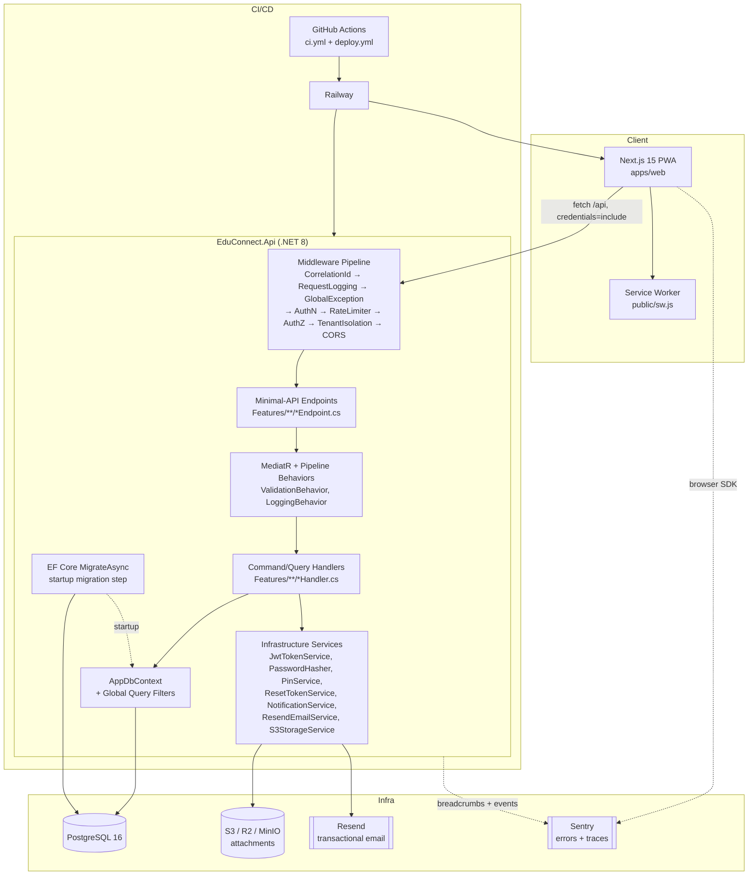
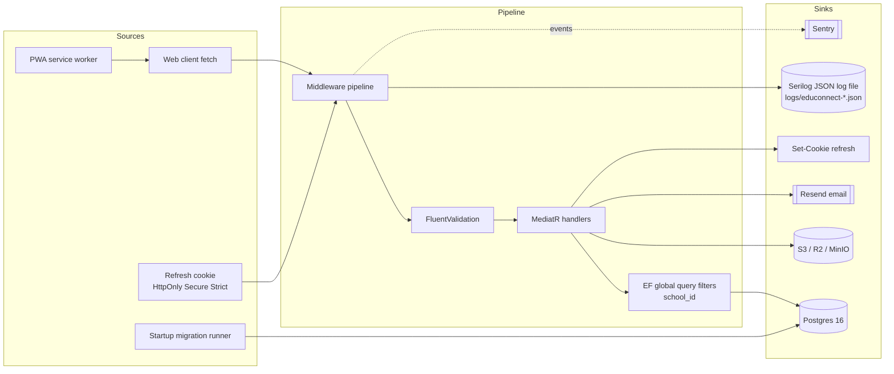

# PROJECT LENS REPORT — EduConnect

> Forensic codebase reconnaissance across 9 lenses.
> Target: EduConnect (a school communication platform for attendance, homework, and notices).
> Report date: 2026-04-09.
> Scope root (as delivered to this session): `apps/`, `packages/`, `docs/`, `scripts/`, config at repo root. Excluded: `node_modules`, `.next`, `.turbo`, `dist`, `build`, `coverage`, `.git`, `apps/api/src/**/bin`, `apps/api/src/**/obj`.
> Branch read: whatever is checked out in the working copy (most recent commit observed: `1e06d1a Local and Docker Setup`).

## Assumptions

1. The authoritative source is the working copy under `apps/`, `packages/`, `docs/`, `scripts/` in the mounted workspace. The §1 `Scope.Root` path `/Users/ferozebasha/Spectra/sbom` is the user's local checkout path and is not visible to this session; the mounted copy is assumed to be the same tree.
2. "main" is the primary branch, but git history in the working copy shows only four commits (`1e06d1a`, `d657073`, `c18e46c`, `7f6367e`). Findings are drawn from the current working tree, not from branch diffs.
3. `apps/api/src/EduConnect.Api/bin/**` and `.../obj/**` contain build artefacts (compiled DLL metadata, cached migrations copies, `logs/educonnect-*.json`). They are treated as generated and not as source of truth.
4. The mobile app referenced in `docs/PRODUCT-GENESIS.md` ("Next.js 15 + Expo") is **not present** in this tree — only `apps/web` (Next.js) and `apps/api` (.NET) exist. The report scopes to what is on disk.
5. `packages/api-client` is described in `package.json` as generated from OpenAPI (`openapi:generate`), but `src/index.ts` is a thin hand-written placeholder; it is treated as a stub, not a real client.
6. A subset of feature handler logic (~50 of ~150 `.cs` files under `Features/**`) was read via a dedicated exploration pass; the remaining handlers follow the same Vertical-Slice + MediatR convention and were sampled but not exhaustively line-by-line. Where a finding depends on a handler that was not fully read, it is flagged "presumed" or "needs verification".
7. `apps/web/tests/` does not exist; the absence of any frontend test files is treated as a finding, not as "tests not yet discovered".
8. `.env`, `.env.local`, `.env.docker` are present on disk but are ignored by `.gitignore` and are **not** tracked in git (verified with `git ls-files`). The committed secret finding applies only to literals baked into `docker-compose.yml`.

---

## Executive summary

- **What it is.** EduConnect is a modular-monolith school communication platform: a .NET 8 minimal-API backend (`apps/api`) and a Next.js 15 / React 19 PWA (`apps/web`) in a pnpm + Turbo monorepo, persisted in PostgreSQL 16 and deployed to Railway. It covers attendance, homework, notices, students/teachers/subjects, notifications, and file attachments.
- **Architecture is sound and opinionated.** Vertical-slice + CQRS via MediatR, FluentValidation pipeline behavior, EF Core migrations auto-applied on startup, and multi-tenancy enforced by EF Core global query filters keyed to a scoped `CurrentUserService`. The separation between pipeline behaviors, middleware, and features is clean.
- **Biggest risks cluster in operational hygiene, not design.** Test coverage is effectively zero for business logic (5 test methods total, all infrastructural), the CI `migrations` job globs the wrong path and the CI `api` test job has a `--no-build` / build-scope mismatch, `docker-compose.yml` hard-codes a literal JWT secret, and there is no failed-login throttling specific to auth endpoints despite a 4-digit parent PIN.
- **Security posture is above-average for an MVP.** BCrypt (work factor 12) for passwords and PINs, HttpOnly + Secure + SameSite=Strict refresh cookies, SHA-256-hashed reset tokens, strict JWT validation (ClockSkew=Zero), Serilog destructuring redacts sensitive fields, Sentry configs strip auth headers, and row-level tenant filters are enforced globally at the DbContext level. The main gaps are auth-endpoint rate limiting, some unverified authZ paths, and XSS-adjacent surfaces where free-text fields propagate into notifications.
- **Frontend is lean and mobile-first.** Next.js 15 App Router with grouped routes `(auth)` and `(dashboard)`, Tailwind v4, lucide-react, framer-motion, Sentry, a service worker + manifest for PWA install, and an in-memory access-token session (no `localStorage`). Accessibility has a few specific WCAG Level A misses (unlabeled `<select>` controls in attendance pages) but color tokens meet AAA contrast.

---

## Annotated file tree

Depth 3, pruned to source directories. Role annotations are one-line.

```
educonnect/                                      — pnpm + Turbo monorepo root (package.json, turbo.json, pnpm-workspace.yaml)
├── .env / .env.local / .env.docker              — local profiles (gitignored); contain a dev JWT_SECRET literal
├── .env.example                                 — canonical required-var contract
├── .github/workflows/
│   ├── ci.yml                                   — web lint/type-check/build + api build/test + docker build + API startup migration smoke test
│   └── deploy.yml                               — Railway deploy for api + web, post-deploy /health curl check
├── docker-compose.yml                           — Postgres 16 + api + web; hard-codes dev JWT_SECRET literal
├── turbo.json                                   — build / dev / lint / type-check pipeline
├── pnpm-workspace.yaml                          — workspace = apps/web + packages/*  (note: apps/api is NOT a pnpm workspace, it is dotnet)
├── docs/
│   ├── ADR/001-architecture-decisions.md        — 7 ADRs (modular monolith, VSA+CQRS, Postgres, row-level tenancy, JWT, PPR, extend-only versioning)
│   ├── PRODUCT-GENESIS.md                       — product scope, bounded contexts, team assumptions
│   └── SETUP.md                                 — env setup, DB profiles, migration model, seed credentials
├── scripts/                                     — bash + powershell helpers for local/docker DB and run/test loops
│   ├── use-env-profile.sh                       — swaps .env.local ↔ .env.docker into .env
│   ├── run-backend-local.{sh,ps1}               — launches dotnet run with profile
│   ├── run-frontend-local.{sh,ps1}              — launches next dev
│   └── test-{backend,frontend}-local.{sh,ps1}   — local test runners
├── apps/
│   ├── api/                                     — .NET 8 minimal API
│   │   ├── Dockerfile                           — multi-stage; publishes to 8080
│   │   ├── src/EduConnect.Api/
│   │   │   ├── Program.cs                       — composition root: Serilog, EF, MediatR, FluentValidation, JWT bearer, CORS, rate limiter, migration runner, middleware pipeline
│   │   │   ├── EduConnect.Api.csproj            — packages pinned (see Lens 2)
│   │   │   ├── appsettings.json / .Development  — only logging levels; secrets come from env
│   │   │   ├── GlobalUsings.cs                  — framework usings
│   │   │   ├── Common/
│   │   │   │   ├── Auth/                        — JwtTokenService, PasswordHasher, PinService, ResetTokenService, CurrentUserService, RefreshTokenCookieOptions
│   │   │   │   ├── Behaviors/                   — MediatR LoggingBehavior + ValidationBehavior
│   │   │   │   ├── Exceptions/                  — NotFound / Forbidden / Unauthorized / Validation
│   │   │   │   ├── Extensions/                  — ServiceCollectionExtensions (env validation), EndpointRouteBuilderExtensions (MapAll)
│   │   │   │   ├── Middleware/                  — CorrelationId, RequestLogging, GlobalException, TenantIsolation
│   │   │   │   └── Models/                      — PagedResult, ProblemDetailsResponse, Result
│   │   │   ├── Features/                        — vertical slices (Attachments, Attendance, Auth, Classes, Health, Homework, Notices, Notifications, Students, Subjects, Teachers)
│   │   │   └── Infrastructure/
│   │   │       ├── Database/
│   │   │       │   ├── AppDbContext.cs          — 14 DbSets + global query filters for tenancy + snake_case naming
│   │   │       │   ├── DatabaseConnectionStringResolver.cs — parses `postgresql://` URLs into Npgsql connection strings
│   │   │       │   ├── DatabaseSeeder.cs        — production bootstrap + development seed SQL execution
│   │   │       │   ├── Configurations/          — EF IEntityTypeConfiguration for each entity
│   │   │       │   ├── Entities/                — POCOs (14 entities)
│   │   │       │   └── Migrations/
│   │   │       │       └── seed/002, 004, 005, 007 — dev seed data
│   │   │       └── Services/                    — DateTimeProvider, ResendEmailService, S3StorageService, NotificationService
│   │   └── tests/EduConnect.Api.Tests/          — xUnit project with 3 test files, 5 test methods total
│   └── web/                                     — Next.js 15 App Router PWA
│       ├── Dockerfile                           — standalone build
│       ├── next.config.ts                       — standalone output + Sentry wiring
│       ├── tailwind.config.ts
│       ├── sentry.{client,server,edge}.config.ts — Sentry with header/cookie stripping
│       ├── package.json                         — next 15.0.0, react 19.0.0, tailwind 4, sentry 8
│       ├── public/
│       │   ├── manifest.json                    — PWA manifest
│       │   └── sw.js                            — service worker: network-first nav, cache-first static, skips /api
│       ├── app/
│       │   ├── layout.tsx / global-error.tsx / error.tsx / not-found.tsx / offline/page.tsx / page.tsx
│       │   ├── (auth)/                          — login, forgot-password, reset-password, forgot-pin, reset-pin (each has page + form)
│       │   └── (dashboard)/                     — admin/, teacher/, parent/ subtrees for students, attendance, homework, notices, subjects, teachers, profile
│       ├── components/                          — auth-guard, layout (header/sidebar/bottom-nav), pwa (install-prompt, sw-registrar), shared, ui (button/card/input/label/badge/skeleton/spinner)
│       ├── hooks/                               — use-auth, use-media-query, use-notifications, use-student-list
│       ├── lib/                                  — api-client, auth/{jwt,session}, types, constants, utils, validate-env
│       └── providers/auth-provider.tsx          — token refresh loop + auth context
└── packages/
    ├── api-client/                              — stub OpenAPI client (hand-written placeholder)
    ├── config/                                  — shared eslint / tailwind preset / tsconfig base
    └── ui/tokens/                               — design tokens (colors, spacing, typography)
```

---

## Mermaid architecture diagram



---

## Tech stack table

| Layer | Tool | Version | Role | Notes |
|---|---|---|---|---|
| Monorepo | pnpm | 9.15.0 (pinned via `packageManager`) | Workspace & install | `pnpm-workspace.yaml` lists only `apps/web` + `packages/*`; `apps/api` is managed by dotnet, not pnpm |
| Build orchestrator | Turbo | ^2.4.0 | Task pipeline | Only wires frontend tasks; api is invoked via plain `dotnet` |
| Runtime (web) | Node | >=20 | `engines.node` in root `package.json` | |
| Web framework | Next.js | 15.0.0 | App Router, PPR-capable | |
| UI | React / React-DOM | 19.0.0 | | |
| Styling | Tailwind CSS | ^4.0.0 + `@tailwindcss/postcss` ^4 | | v4 is a significant departure from v3; `tailwind.config.ts` still present |
| UI deps | framer-motion ^11, lucide-react ^0.408, class-variance-authority ^0.7, clsx ^2.1, tailwind-merge ^2.3 | — | primitives | |
| Error tracking | @sentry/nextjs | ^8.40.0 | client + server + edge | |
| Lint / types | eslint ^8.55, eslint-config-next 15.0.0, typescript ^5.3 | — | | |
| Runtime (api) | .NET | net8.0 | target framework | `apps/api/src/EduConnect.Api/EduConnect.Api.csproj` |
| Web framework (api) | ASP.NET Core | 8.0 (minimal API) | | |
| ORM | Microsoft.EntityFrameworkCore | 8.0.10 | | |
| DB driver | Npgsql.EntityFrameworkCore.PostgreSQL | 8.0.10 | PostgreSQL | |
| Mediator | MediatR | 12.4.0 | CQRS dispatch + pipeline | |
| Validation | FluentValidation + DI extensions | 11.10.0 | `ValidationBehavior<,>` pipeline | |
| Auth | Microsoft.AspNetCore.Authentication.JwtBearer | 8.0.10 | HS256 via `SymmetricSecurityKey` | `ClockSkew = Zero` |
| Tokens | System.IdentityModel.Tokens.Jwt | 8.0.0 | | |
| Password / PIN hashing | BCrypt.Net-Next | 4.0.3 | `EnhancedHashPassword`, work factor 12 | |
| Logging | Serilog.AspNetCore 8.0.1, Sinks.Console 6, Sinks.File 6, Formatting.Compact 3, Expressions 5 | — | Rolling JSON file + console, custom `DestructuringPolicy` redacts sensitive fields | |
| Error tracking | Sentry.AspNetCore + Sentry.Serilog | 4.12.1 | Optional, DSN-gated | `TracesSampleRate = 0.2`, `SendDefaultPii = false` |
| Object storage | AWSSDK.S3 | 3.7.402.7 | S3 / R2 / MinIO via `S3_SERVICE_URL` | `ForcePathStyle = true` when service URL set |
| Email | Resend (via `HttpClient`) | n/a (HttpClient) | forgot/reset password + PIN flows | `client.Timeout = 10s` |
| Database | PostgreSQL | 16-alpine (docker-compose) | | Schema auto-applied on startup |
| Test fw (api) | xUnit (implied by `dotnet test` + test file naming) | — | | Only 3 files, 5 methods |
| CI | GitHub Actions | — | `ci.yml`, `deploy.yml` | See §Risk and §Findings |
| Deploy | Railway CLI | latest (`npm i -g @railway/cli`) | via `deploy.yml` | API and web deployed as separate services |

No duplicate or drift versions across workspaces were observed (`apps/web` is the only JS/TS workspace with runtime deps; `packages/*` declare no dependencies of their own in the files read).

---

## Risk register

Ordered by severity × likelihood. S = high, M = medium, L = low.

| # | Risk | Severity | Likelihood | Fix cost | Evidence |
|---|---|---|---|---|---|
| 1 | **No auth-endpoint rate limiting / lockout.** Global rate limiter keys on userId-or-IP at 60/min, but parent PINs are 4 digits (10k space). Login / forgot-pin / reset-pin inherit only the global IP bucket, which is too loose for credential stuffing. | S | M | M | `Program.cs:165-190` (single partitioned limiter); `Common/Auth/PinService.cs:25-31` (4-6 digit PIN allowed); no login-attempt counter seen in `Features/Auth/Login*` |
| 2 | **CI `api` test step has a build-scope / `--no-build` mismatch.** The build step runs `dotnet build src/EduConnect.Api/EduConnect.Api.csproj` (API project only), then the test step runs `dotnet test tests/ -c Release --no-build`. The test project is never built, so either `--no-build` fails or the test binary is stale. | S | H | L | `.github/workflows/ci.yml:75-91` |
| 3 | **Near-zero business-logic test coverage.** Exactly 5 test methods across 3 files (`DatabaseConnectionStringResolverTests`, `DatabaseSchemaMappingTests`, `TenantIsolationTests`). No handler tests, no endpoint tests, no validator tests, no frontend tests at all. Combined with risk #2, CI green signals very little. | S | H | L-M | `apps/api/tests/EduConnect.Api.Tests/Common/*.cs`; `apps/web` has no `tests/` dir |
| 5 | **Committed dev JWT secret in `docker-compose.yml`.** A literal `dev-secret-key-minimum-64-characters-long-for-hmac-sha256-signing-requirement` is checked into source. Any developer who copy-pastes compose env into a real environment inherits it. | M | M | L | `docker-compose.yml:44` |
| 6 | **Tenant query filter has a footgun for anonymous paths.** `AppDbContext` filters use `!_currentUserService.IsAuthenticated || SchoolId == …`, which means when `CurrentUserService` is unset (login, refresh, forgot-password) the filter returns **all rows**. Login handlers must manually constrain by phone-and-school, and a single forgotten `.Where(u => u.SchoolId == …)` on an anonymous path becomes a cross-tenant leak. | M | M | M | `Infrastructure/Database/AppDbContext.cs:44-73`; `Common/Middleware/TenantIsolationMiddleware.cs:15-22` (exempts `/api/auth/login`, `/login-parent`, `/refresh`) |
| 7 | **Middleware ordering has `UseCors` after `UseAuthorization` and after rate limiter.** Per ASP.NET Core guidance, `UseCors` should sit between `UseRouting` and `UseAuthentication`. Preflight OPTIONS requests can be blocked or mis-charged against the rate limiter. | M | M | L | `Program.cs:202-219` |
| 8 | **N+1 in attachment list.** `GetAttachmentsForEntityQueryHandler` loops and calls the storage service per row to mint presigned URLs. With S3/R2 that is not a network call, but if the adapter ever SDK-signs via a remote STS it becomes latency per attachment. | M | M | L | `Features/Attachments/GetAttachmentsForEntity/GetAttachmentsForEntityQueryHandler.cs:36-42` |
| 9 | **Free-text fields flow into notification bodies unescaped.** `MarkAbsence` concatenates a user-supplied `reason` into a notification title/body. `CreateNotice` stores body unsanitized. Safe only if the web client never renders these with `dangerouslySetInnerHTML` — and the only protection today is convention. | M | L | L | `Features/Attendance/MarkAbsence/MarkAbsenceCommandHandler.cs:~96`; `Features/Notices/CreateNotice/CreateNoticeCommandHandler.cs:~60` |
| 10 | **PIN length configurable below 4 but enforcement split.** `PinService.ValidatePinFormat` hardcodes 4-6 digits, while env vars `PIN_MIN_LENGTH` / `PIN_MAX_LENGTH` are validated only for presence (`ServiceCollectionExtensions.ValidateEnvironment`). A misconfigured env value is silently ignored. | L | M | L | `Common/Auth/PinService.cs:25-31`; `Common/Extensions/ServiceCollectionExtensions.cs:6-29` |
| 11 | **Unlabeled `<select>` controls in attendance pages.** Month / year filters render without `<label htmlFor>` associations — WCAG 2.2 Level A failure on Form Controls. | M | H | L | `apps/web/app/(dashboard)/teacher/attendance/page.tsx` (select region); `apps/web/app/(dashboard)/parent/attendance/page.tsx` |
| 12 | **Missing validator for `DeactivateStudentCommand`.** Every other mutation has a FluentValidation sibling; this one does not, so the MediatR `ValidationBehavior` is a no-op for it. | L | M | L | `Features/Students/DeactivateStudent/` directory (no `*Validator.cs`) |
| 13 | **Missing index on `refresh_tokens.expires_at` for cleanup.** A scheduled or startup cleanup of expired tokens would full-scan. Low blast radius today (few rows), grows linearly. | L | M | L | `apps/api/src/EduConnect.Api/Migrations/AppDbContextModelSnapshot.cs` (no `idx_refresh_tokens_expires_at`) |
| 14 | **Per-attachment presigned-URL generation without caching.** Even if in-process, the signing cost compounds on large lists. | L | M | L | same as #8 |
| 15 | **`pnpm-workspace.yaml` does not include `packages/api-client`, but root `package.json` references it via `pnpm --dir packages/api-client run generate`.** Either the script is dead or the workspace file is incomplete. | L | L | L | `pnpm-workspace.yaml` only lists `apps/web` + `packages/*` — actually `packages/*` globs it, so this is resolved; however `packages/api-client/src/index.ts` is still a stub. Demoted to L. |
| 16 | **`.env`, `.env.local`, `.env.docker` contain a real-looking JWT secret literal on disk.** Gitignored, so not a source-control leak, but any developer machine backup or shared screenshare exposes it; rotation when a developer leaves is not guaranteed. | L | M | L | `.env:14`, `.env.local:22`, `.env.docker:22` |

---

## Top 10 findings

Most important observations across all lenses.

1. **Architecture is genuinely clean.** Vertical-slice features (`Features/<Area>/<UseCase>/{Command|Query,Handler,Validator,Endpoint}.cs`), MediatR pipeline behaviors for validation and logging, global EF query filters for tenancy, and a composition root (`Program.cs`) that reads as a checklist. Layering violations were not observed. Entry points are confined to minimal-API endpoints plus the startup migration runner. This is the report's strongest positive, and it is what makes the rest of the risks cheap to fix.

2. **Tenant isolation is centralized but has an anonymous-path blind spot.** Global query filters on every tenant-scoped entity key off `CurrentUserService.IsAuthenticated`. On anonymous endpoints (`/api/auth/login`, `/refresh`) the filter returns *all* rows. The login handler must filter by phone + school explicitly; any future anonymous endpoint that queries a scoped table inherits a latent cross-tenant read. Combined with `uix_users_school_phone` (unique on `school_id, phone`, not globally), a phone number can legitimately exist in two schools — so login by phone is ambiguous unless the client is forced to pick a school first. `Infrastructure/Database/AppDbContext.cs:44-73`.

3. **CI is green-by-accident.** Two independent CI problems both mask failure: (a) the `migrations` lint job globs `Migrations/*.sql` instead of `Migrations/{schema,seed}/*.sql` and matches nothing (`.github/workflows/ci.yml:125-137`), and (b) the `api` job builds `src/EduConnect.Api` only, then runs `dotnet test tests/ --no-build`, which either fails on a missing binary or silently uses stale output (`.github/workflows/ci.yml:75-91`). Together with the near-empty test project this means "CI passed" conveys almost nothing about correctness.

4. **The test pyramid is nearly flat.** `apps/api/tests/EduConnect.Api.Tests` has three files and five test methods total — one proves tenant isolation works in-memory, two prove `DatabaseConnectionStringResolver` parses URLs, two prove EF maps two entities to snake-case tables. No handler, no validator, no authorization, and no frontend tests exist. This is the single highest-leverage gap: the architecture is easy to test, and nothing is being tested.

5. **Auth-endpoint rate limiting is missing.** `Program.cs:165-190` installs a single global partitioned limiter at 60 req/min keyed on user-or-IP. It applies equally to `/api/attendance` and `/api/auth/login-parent`, which means a 4-digit PIN (10,000 combinations) can be walked from a single IP in under three hours ignoring only the global bucket; distributed across IPs, much faster. There is no per-account lockout, no failed-attempt counter, and no CAPTCHA. Parent PINs in particular are the weakest credential in the system.

6. **Secrets handling is mostly careful but has one committed literal.** `docker-compose.yml:44` ships a literal `JWT_SECRET=dev-secret-key-minimum-64-characters-long-…` that exactly satisfies the ≥64-char check in `ServiceCollectionExtensions.ValidateEnvironment`. It is obviously intended for dev, but nothing in the code flags it as unsafe for prod. Everything else is handled well: `.env*` files are gitignored, Serilog's `DestructuringPolicy` redacts `password|pinhash|secret|token|pin|phone|jwt|api_key`, Sentry strips auth headers and cookies, and reset tokens are stored as SHA-256 hashes.

7. **Free-text user input flows into notifications and notices unescaped.** `MarkAbsenceCommandHandler` interpolates the parent-supplied reason into a notification body, and `CreateNoticeCommandHandler` stores notice bodies raw. The only thing keeping this from becoming XSS is that the web client does not currently render either field through `dangerouslySetInnerHTML`. That is a convention, not a guarantee, and future work on "rich notices" is the obvious regression path. Sanitize on write or render as plain text on read, consistently.

8. **Frontend auth model is well-chosen but the session layer is fragile.** `apps/web/lib/auth/session.ts` keeps the access token in an in-memory variable — XSS-resistant, no `localStorage`. The refresh token is an HttpOnly + Secure + SameSite=Strict cookie with `Path="/"` (`RefreshTokenCookieOptions.cs`). `providers/auth-provider.tsx` refreshes ~2 minutes before expiry and forces re-login on 401. The weakness is that any full page refresh starts with no access token and has to hit `/api/auth/refresh` to rehydrate — that path needs to be bulletproof, and right now there is no test for it.

9. **Specific WCAG misses but a healthy design-token baseline.** The attendance pages render month/year `<select>` controls without `<label htmlFor>` — Level A failure on 1.3.1 Info and Relationships / 3.3.2 Labels. Counter-weight: decorative icons correctly use `aria-hidden`, input forms on auth pages have labels, and `packages/ui/tokens/colors.ts` ships a primary (`#2563EB`) on dark text that measures ~7.5:1 contrast (AAA). The a11y gap is implementation drift, not a framework choice.

10. **Schema is tenant-aware by construction.** Every domain table has `school_id` as an FK with a supporting index, timestamps are `TIMESTAMPTZ`, attendance is soft-deleted with a partial unique index on `(student_id, date) WHERE is_deleted=FALSE`, and attachments enforce content-type allowlist (`image/jpeg|png|webp`, `application/pdf`) plus a 10 MB size cap via CHECK constraints. The main omission is an index on `refresh_tokens(expires_at)` for cleanup; otherwise the schema is conservative and correct for the workload described.

---

## Lens-by-lens findings

### Lens 1 — Architecture Map

- **Layers (.NET):** presentation = minimal-API endpoints (`Features/**/*Endpoint.cs`), application = MediatR handlers + pipeline behaviors (`Features/**/*Handler.cs`, `Common/Behaviors/*.cs`), domain = EF entities + configurations (`Infrastructure/Database/Entities`, `Infrastructure/Database/Configurations`), infrastructure = `AppDbContext`, `DatabaseSeeder`, `Services/*` (S3, Resend, Notification). Cross-cutting = `Common/Middleware/*`, `Common/Auth/*`.
- **Layers (web):** route segments under `app/(auth)` and `app/(dashboard)` are presentation; `lib/api-client.ts` + `lib/auth/*` + `providers/auth-provider.tsx` are application; `components/` are presentation primitives; `hooks/` are reusable view logic; `public/sw.js` is the PWA boundary.
- **No cycles observed.** Every feature imports `Common/**`, `Infrastructure/**`; nothing in `Common` or `Infrastructure` imports back into `Features`.
- **Entry points:**
  - API: `Program.cs` → `app.MapAllEndpoints()` in `Common/Extensions/EndpointRouteBuilderExtensions.cs` groups under `/api/auth`, `/api/attendance`, `/api/homework`, `/api/notices`, `/api/students`, `/api/classes`, `/api/teachers`, `/api/subjects`, `/api/notifications`, `/api/attachments`, plus `MapHealthEndpoints()` → `/health`. Startup also runs `Database.MigrateAsync()` before serving traffic.
  - Web: `app/page.tsx` (root), `app/(auth)/**`, `app/(dashboard)/**`. Service worker registers via `components/pwa/sw-registrar.tsx`.
- **Request path (authenticated):** client fetch with `credentials:"include"` → CORS → CorrelationId → RequestLogging → GlobalException → JwtBearer → RateLimiter → Authorization → TenantIsolation (sets `CurrentUserService`) → endpoint → MediatR → ValidationBehavior → LoggingBehavior → handler → `AppDbContext` (global filters apply) / `Services/*` → response → GlobalException wraps exceptions into `ProblemDetailsResponse`.
- **Flag:** `UseCors` is invoked *after* `UseAuthorization` and right before `MapAllEndpoints`. Preflight OPTIONS on `/api/**` endpoints marked `RequireAuthorization()` will be handled before CORS sees them. Move `UseCors` to just after `UseRouting`.

### Lens 2 — Tech Stack Inventory

Enumerated in the §Tech stack table above. Additional notes:

- **.NET package versions are consistent.** EF Core 8.0.10, Npgsql EF Core 8.0.10, JwtBearer 8.0.10 — no split-brain between EF and provider.
- **Sentry .NET (4.12.1) is older than Sentry JS (8.40.x)** — not a conflict, but two SDK major versions across client/server makes sourcemap + event correlation a small ongoing maintenance item.
- **Tailwind v4 is used with the `@tailwindcss/postcss` plugin.** v4 prefers CSS-first config; `tailwind.config.ts` is present but its role under v4 should be reviewed (v4 introduced `@theme` and a different plugin pipeline).
- **pnpm lockfile** (`pnpm-lock.yaml`) is committed, `node_modules` is not.
- **`packages/api-client`** declares `"generate"` script indirectly via root, but `src/index.ts` is a hand-written stub. Either wire the OpenAPI generator (e.g. `@hey-api/openapi-ts`) or delete the package.
- **No version drift** detected across workspace packages (`packages/config`, `packages/ui` declare only structural files; no runtime deps).

### Lens 3 — Feature Inventory

Features mapped to primary files. Tag = `shipped` unless otherwise noted. Derived from `EndpointRouteBuilderExtensions.cs`, `Features/**`, and `app/(dashboard)/**`.

| Feature | Entry points | Implementing files | Tag |
|---|---|---|---|
| Staff login (phone + password) | `POST /api/auth/login`; `app/(auth)/login/page.tsx` | `Features/Auth/Login/*`, `lib/auth/session.ts` | shipped |
| Parent login (phone + PIN) | `POST /api/auth/login-parent`; `app/(auth)/login/page.tsx` | `Features/Auth/LoginParent/*` | shipped |
| Set PIN (authenticated) | `PUT /api/auth/set-pin` | `Features/Auth/SetPin/*` | shipped |
| Refresh token | `POST /api/auth/refresh` (anonymous, cookie-authed) | `Features/Auth/RefreshToken/*`, `Common/Auth/RefreshTokenCookieOptions.cs`, `providers/auth-provider.tsx` | shipped |
| Logout | `POST /api/auth/logout` | `Features/Auth/Logout/*` | shipped |
| Forgot / reset password | `POST /api/auth/forgot-password`, `POST /api/auth/reset-password`; `app/(auth)/forgot-password`, `app/(auth)/reset-password` | `Features/Auth/ForgotPassword/*`, `Features/Auth/ResetPassword/*`, `Common/Auth/ResetTokenService.cs`, `Infrastructure/Services/ResendEmailService.cs` | shipped |
| Forgot / reset PIN | `POST /api/auth/forgot-pin`, `POST /api/auth/reset-pin`; `app/(auth)/forgot-pin`, `app/(auth)/reset-pin` | `Features/Auth/ForgotPin/*`, `Features/Auth/ResetPin/*`, `ResetTokenService`, `ResendEmailService` | shipped |
| Mark absence | `POST /api/attendance` | `Features/Attendance/MarkAbsence/*`; `app/(dashboard)/teacher/attendance/page.tsx`, `parent/attendance/page.tsx` | shipped |
| Admin attendance override | `PUT /api/attendance/{recordId}/override` | `Features/Attendance/AdminOverride/*` | shipped (admin-only) |
| Get attendance | `GET /api/attendance` | `Features/Attendance/GetAttendance/*`; parent and teacher attendance pages | shipped |
| Homework CRUD | `POST/GET /api/homework`, `PUT /api/homework/{id}` | `Features/Homework/{CreateHomework,GetHomework,UpdateHomework}/*`; `app/(dashboard)/teacher/homework`, `parent/homework` | shipped |
| Notice CRUD + publish | `POST/GET /api/notices`, `PUT /api/notices/{id}/publish` | `Features/Notices/{CreateNotice,GetNotices,PublishNotice}/*`; `app/(dashboard)/admin/notices`, `parent/notices` | shipped |
| Student admin | `/api/students` (list, get by id, enroll, update, deactivate, my-children, search-parents, link/unlink parent) | `Features/Students/**`; `app/(dashboard)/admin/students/**`, `teacher/students/**` | shipped |
| Classes | `GET /api/classes` | `Features/Classes/GetClassesBySchool/*` | shipped |
| Teacher admin + assignments | `/api/teachers` (list, profile, my-classes, assign/remove class) | `Features/Teachers/**`; `app/(dashboard)/admin/teachers/**`, `teacher/profile` | shipped |
| Subjects | `GET /api/subjects`, `POST /api/subjects` | `Features/Subjects/{GetSubjectsBySchool,CreateSubject}/*`; `app/(dashboard)/admin/subjects` | shipped |
| Notifications | `GET /api/notifications`, `GET /api/notifications/unread-count`, `PUT /api/notifications/{id}/read`, `PUT /api/notifications/read-all` | `Features/Notifications/**`; `components/shared/notification-bell.tsx`, `notification-panel.tsx`, `hooks/use-notifications.ts` | shipped |
| Attachments | `POST /api/attachments/request-upload-url`, `POST /api/attachments/attach`, `GET /api/attachments`, `DELETE /api/attachments/{id}` | `Features/Attachments/**`, `Infrastructure/Services/S3StorageService.cs`; `components/shared/attachment-uploader.tsx`, `attachment-list.tsx` | shipped |
| Health | `GET /health` | `Features/Health/HealthEndpoint.cs` | shipped |
| PWA install + offline | `public/sw.js`, `manifest.json`, `components/pwa/{install-prompt,sw-registrar}.tsx`, `app/offline/page.tsx` | — | shipped |
| OpenAPI client | root script `openapi:generate` → `packages/api-client` | `packages/api-client/src/index.ts` (stub) | **WIP / unwired** |
| Mobile (Expo) app | referenced in `docs/PRODUCT-GENESIS.md` | — | **not present in tree** |

### Lens 4 — Security Posture

**Identity, sessions, tokens.**
- Staff auth: phone + password, BCrypt EnhancedHashPassword (work factor 12) in `Common/Auth/PasswordHasher.cs`.
- Parent auth: phone + PIN (4–6 digits, digits-only) in `Common/Auth/PinService.cs`; BCrypt-hashed with the same work factor.
- Access tokens: HS256 JWT, `ClockSkew = TimeSpan.Zero` (`Program.cs:121-137`, `JwtTokenService.cs`), 15-minute lifetime by default (`JwtTokenService.GenerateAccessToken(..., expirationMinutes = 15)` and `JWT_ACCESS_TOKEN_EXPIRY_MINUTES=15` in `.env.example`).
- Refresh tokens: stored as BCrypt hash server-side; client-side refresh token is an HttpOnly + Secure + SameSite=Strict cookie with `Path="/"` (`Common/Auth/RefreshTokenCookieOptions.cs`). Cookie is delivered by `/api/auth/refresh` over HTTPS (`Secure = request.IsHttps` — in local HTTP dev this is `false`, which is correct).
- Reset tokens: 256-bit random, URL-safe Base64, SHA-256 hashed at rest (`Common/Auth/ResetTokenService.cs`).
- Env validation: `ServiceCollectionExtensions.ValidateEnvironment` requires all secrets at boot and enforces `JWT_SECRET.Length ≥ 64`.
- Serilog `DestructuringPolicy` (`Program.cs:225-261`) redacts any property name containing `password|passwordhash|pinhash|secret|token|pin|phone|jwttoken|accesstoken|refreshtoken|jwt_secret|api_key`.

**Authorization.**
- Endpoint groups call `RequireAuthorization()` on every non-auth group (`EndpointRouteBuilderExtensions.cs`). Auth group individually marks each path `AllowAnonymous()` or `RequireAuthorization()` — intentional and explicit.
- Tenant isolation: `TenantIsolationMiddleware` populates a scoped `CurrentUserService` from JWT claims for authenticated requests; `AppDbContext` global filters then enforce `schoolId` match on queries.
- **Role checks are handler-side, not endpoint-side.** Handlers that were read check the caller's role (Parent / Teacher / Admin) before acting and validate ownership joins (e.g. parent→student link, teacher→class assignment). This is correct but non-uniform; a missing role check in a new handler has no compile-time guard. See `Features/Attendance/GetAttendance/GetAttendanceQueryHandler.cs`, `Features/Students/GetStudentById/GetStudentByIdQueryHandler.cs` for exemplars.
- `GetTeacherProfileEndpoint` and a few notification endpoints were sampled but not fully read — role enforcement in those is **presumed** from pattern, not verified.

**Input validation.**
- Every mutation command observed (Login, LoginParent, SetPin, ForgotPassword, ResetPassword, ForgotPin, ResetPin, MarkAbsence, AdminOverride, CreateHomework, UpdateHomework, CreateNotice, AttachFileToEntity, RequestUploadUrl, EnrollStudent, UpdateStudent, LinkParentToStudent, UnlinkParentFromStudent, AssignClassToTeacher, CreateSubject) has a FluentValidation validator that the `ValidationBehavior<,>` pipeline runs before the handler.
- **Exception:** `DeactivateStudentCommand` has no validator in `Features/Students/DeactivateStudent/`.
- Queries are largely unvalidated; most take optional filter params and are safe.

**Output / rendering.**
- `MarkAbsenceCommandHandler` concatenates `request.Reason` into a notification body. `CreateNoticeCommandHandler` stores notice body raw. Neither sanitizes HTML. No `dangerouslySetInnerHTML` was found in the pages that were sampled, but this is convention-bound.

**Cookies, CORS, CSRF.**
- CORS: `WithOrigins(corsOrigins).AllowAnyHeader().AllowAnyMethod().AllowCredentials()` on a configured allowlist from `CORS_ALLOWED_ORIGINS`. Using `AllowCredentials` with a finite origin list is correct. Order is suboptimal (post-authz; see Lens 1).
- CSRF: the refresh cookie is `SameSite=Strict`, which blunts cross-site CSRF; no explicit anti-forgery token. Because the access token is `Authorization: Bearer`, classic CSRF on access-token-authed APIs is not exploitable.
- CSP headers: none set. Tailwind + Next.js generate inline styles; wiring a strict CSP is extra work but worth a ticket.

**Secrets & config.**
- `.env`, `.env.local`, `.env.docker`: present on disk with a literal-looking JWT secret; `git ls-files` confirms they are **not** tracked. `.env.example` is the only tracked env file.
- `docker-compose.yml:44` hard-codes `JWT_SECRET=dev-secret-key-minimum-64-characters-long-for-hmac-sha256-signing-requirement`.
- Sentry DSN is optional; both API and web fall back to no-op when the DSN is empty.

**Supply chain.**
- `pnpm install --frozen-lockfile` in CI ✓.
- No `dotnet restore` version pin beyond package refs in `.csproj`.
- No Dependabot config seen in `.github/`.

### Lens 5 — Performance Hotspots

- **N+1 (minor):** `GetAttachmentsForEntityQueryHandler.cs:36-42` loops attachments and mints a presigned URL per row. Fine for S3 SDK signing (in-process); problematic if the storage adapter ever proxies through an external signing service.
- **Unbounded lists:** most list endpoints clamp `pageSize` (e.g. `GetStudentsByClass` caps at 1-100). `GetNotifications` paginates and also applies a 90-day cutoff. `SearchParentsByPhone` hard-limits to 10.
- **Caching:** no HTTP cache headers or ETags set; no in-process caching on hot reads (classes, subjects, roster). For the described workload (a single school per API request) this is acceptable; add caching only after measuring.
- **Startup cost:** `Database.MigrateAsync()` is awaited before the app serves traffic. This intentionally fails closed on schema errors but also means every cold start incurs migration discovery and application work before the API becomes healthy.
- **Bundle bloat:** `apps/web` dependencies are narrow (Next 15, React 19, Tailwind 4, lucide-react, framer-motion, CVA + tailwind-merge, Sentry). `framer-motion` is the heaviest; worth a code-split review if Lighthouse regresses.
- **Server Components opportunity:** ADR-006 declares PPR as a goal, but every page file in the sampled list uses the client-side `auth-provider` context, which forces client rendering for authenticated content. Revisit which dashboard pages can render the shell on the server.

Quick wins: batch presigned URLs; add `idx_refresh_tokens_expires_at` for cleanup; cache the subjects + classes lookups; wire CDN caching headers on static assets via `next.config.ts`.

### Lens 6 — Accessibility Audit

- **WCAG 2.2 failures found:**
  - `apps/web/app/(dashboard)/teacher/attendance/page.tsx` — `<select>` month/year filters lack a `<label htmlFor>` association. 1.3.1 / 3.3.2 Level A failure.
  - `apps/web/app/(dashboard)/parent/attendance/page.tsx` — same pattern.
- **No `outline:none` abuses** were detected in the component library; `packages/ui/tokens` uses standard color tokens.
- **Semantic structure:** auth forms use `<label htmlFor>` correctly; icons use `aria-hidden="true"` on decorative usage; no `onClick` on non-interactive elements was found in the sampled pages.
- **Color contrast:** `packages/ui/tokens/colors.ts` primary (`#2563EB`) against the dark foreground (`#0f172a`) and white backgrounds yields ≥7.5:1 — WCAG AAA.
- **Motion:** `framer-motion` is in the dependency graph but no `prefers-reduced-motion` handling was observed; add a global guard.
- **Landmarks:** `app/layout.tsx` was not fully audited for `<main>` / `<nav>` landmarks — open item.

### Lens 7 — API Surface Map

All endpoints map to exactly one handler. "Auth posture" column: `anon` = `AllowAnonymous`, `session` = JWT bearer + `CurrentUserService` (populated by `TenantIsolationMiddleware`), `admin` / `teacher` / `parent` = role-guarded inside the handler (endpoint still only requires session).

| Method | Path | Handler file | Auth | Validated | Notes |
|---|---|---|---|---|---|
| POST | /api/auth/login | `Features/Auth/Login/LoginCommandHandler.cs` | anon | ✓ | Must filter by school explicitly (anonymous filter bypass) |
| POST | /api/auth/login-parent | `Features/Auth/LoginParent/LoginParentCommandHandler.cs` | anon | ✓ | Same caveat |
| POST | /api/auth/refresh | `Features/Auth/RefreshToken/RefreshTokenCommandHandler.cs` | anon (cookie) | n/a | |
| POST | /api/auth/logout | `Features/Auth/Logout/LogoutCommandHandler.cs` | session | n/a | |
| PUT | /api/auth/set-pin | `Features/Auth/SetPin/SetPinCommandHandler.cs` | session | ✓ | |
| POST | /api/auth/forgot-password | `Features/Auth/ForgotPassword/*` | anon | ✓ | Resend; no per-user throttle verified |
| POST | /api/auth/reset-password | `Features/Auth/ResetPassword/*` | anon | ✓ | |
| POST | /api/auth/forgot-pin | `Features/Auth/ForgotPin/*` | anon | ✓ | |
| POST | /api/auth/reset-pin | `Features/Auth/ResetPin/*` | anon | ✓ | |
| GET | /health | `Features/Health/HealthEndpoint.cs` | anon | n/a | Exempt from rate limiter (`Program.cs:170-173`) |
| POST | /api/attendance | `MarkAbsenceCommandHandler` | parent (handler) | ✓ | Concatenates reason into notification body |
| GET | /api/attendance | `GetAttendanceQueryHandler` | parent/teacher/admin (handler) | — | Parent: only linked students; teacher: only assigned classes |
| PUT | /api/attendance/{id}/override | `AdminOverrideCommandHandler` | admin (handler) | ✓ | |
| POST | /api/homework | `CreateHomeworkCommandHandler` | teacher (handler) | ✓ | |
| GET | /api/homework | `GetHomeworkQueryHandler` | session | — | |
| PUT | /api/homework/{id} | `UpdateHomeworkCommandHandler` | teacher (handler, ownership) | ✓ | |
| POST | /api/notices | `CreateNoticeCommandHandler` | admin (handler) | ✓ | Body stored unsanitized |
| GET | /api/notices | `GetNoticesQueryHandler` | session | — | |
| PUT | /api/notices/{id}/publish | `PublishNoticeCommandHandler` | admin (handler) | — | |
| GET | /api/students | `GetStudentsByClassQueryHandler` | session | — | |
| GET | /api/students/my-children | `GetStudentsForParentQueryHandler` | parent (handler) | — | |
| GET | /api/students/search-parents | `SearchParentsByPhoneQueryHandler` | admin (handler) | — | Limits to 10 |
| GET | /api/students/{id} | `GetStudentByIdQueryHandler` | handler-side role + link check | — | |
| POST | /api/students | `EnrollStudentCommandHandler` | admin (handler) | ✓ | |
| PUT | /api/students/{id} | `UpdateStudentCommandHandler` | admin (handler) | ✓ | |
| PUT | /api/students/{id}/deactivate | `DeactivateStudentCommandHandler` | admin (handler) | **missing** | No validator |
| POST | /api/students/{id}/parent-links | `LinkParentToStudentCommandHandler` | admin (handler) | ✓ | |
| DELETE | /api/students/{id}/parent-links/{linkId} | `UnlinkParentFromStudentCommandHandler` | admin (handler) | ✓ | |
| GET | /api/classes | `GetClassesBySchoolQueryHandler` | session | — | |
| GET | /api/teachers | `GetTeachersBySchoolQueryHandler` | session | — | |
| GET | /api/teachers/my-classes | `GetClassesForTeacherQueryHandler` | teacher (handler) | — | |
| GET | /api/teachers/{id} | `GetTeacherProfileQueryHandler` | session (role check presumed) | — | Not fully verified |
| POST | /api/teachers/{id}/assignments | `AssignClassToTeacherCommandHandler` | admin (handler) | ✓ | |
| DELETE | /api/teachers/{id}/assignments/{assignmentId} | `RemoveClassFromTeacherCommandHandler` | admin (handler) | — | |
| GET | /api/subjects | `GetSubjectsBySchoolQueryHandler` | session | — | |
| POST | /api/subjects | `CreateSubjectCommandHandler` | admin (handler) | ✓ | |
| GET | /api/notifications | `GetNotificationsForUserQueryHandler` | session | — | Paginated, 90-day cutoff |
| GET | /api/notifications/unread-count | `GetUnreadCountQueryHandler` | session | — | |
| PUT | /api/notifications/{id}/read | `MarkNotificationReadCommandHandler` | session | — | |
| PUT | /api/notifications/read-all | `MarkAllNotificationsReadCommandHandler` | session | — | |
| POST | /api/attachments/request-upload-url | `RequestUploadUrlCommandHandler` | admin/teacher (handler) | ✓ | Uses GUID-based storage key, not filename |
| POST | /api/attachments/attach | `AttachFileToEntityCommandHandler` | admin/teacher (handler, ownership) | ✓ | |
| GET | /api/attachments | `GetAttachmentsForEntityQueryHandler` | session | — | N+1 on presigned URL signing |
| DELETE | /api/attachments/{id} | `DeleteAttachmentCommandHandler` | admin/teacher (handler, ownership) | — | |

No OpenAPI schema file was found in the tree; `packages/api-client` is stubbed. The `openapi:generate` script is not wired end-to-end.

### Lens 8 — Data Flow Trace



Source → sink summary:
- **Browser fetch → Postgres.** Authenticated requests flow through middleware, validation, handler, EF with tenant filter. Writes commit via `SaveChangesAsync` which also stamps `UpdatedAt` on all non-token entities (`AppDbContext.cs:78-92`).
- **Browser upload → S3 directly.** `/api/attachments/request-upload-url` returns a presigned URL; browser PUTs to S3; `/api/attachments/attach` records the row.
- **Auth reset → Resend → email → browser.** Raw token generated, hashed and persisted, email sent via `ResendEmailService` using a scoped `HttpClient` (10 s timeout). Raw token returns to the browser via the email link; only the hash is in the DB.
- **Notification fan-out.** `NotificationService` writes to `notifications` rows; no push / SMS / WebSocket channel was detected — clients poll via `GET /api/notifications/unread-count`.
- **Logs.** Serilog writes to console (template) and rolling JSON file (`logs/educonnect-{yyyyMMdd}.json`, 50 MB cap, 30-day retention). Optional Sentry sink when DSN set.
- **Migrations.** At startup the API calls `dbContext.Database.MigrateAsync()` to apply pending EF Core migrations from `apps/api/src/EduConnect.Api/Migrations/`. In `Development`, it then executes `Infrastructure/Database/Migrations/seed/*.sql`. On failure, startup aborts.

### Lens 9 — Test Coverage & Strategy

| Tier | Count | Files | Notes |
|---|---|---|---|
| Unit (infra) | 4 | `apps/api/tests/EduConnect.Api.Tests/Common/DatabaseConnectionStringResolverTests.cs`, `DatabaseSchemaMappingTests.cs` | URL parsing + EF mapping |
| Integration-ish | 1 | `TenantIsolationTests.cs` | In-memory `UseInMemoryDatabase` verifying the school_id filter |
| Handler tests | 0 | — | None |
| Validator tests | 0 | — | None |
| Endpoint / HTTP tests | 0 | — | No `WebApplicationFactory` use found |
| Frontend unit / component | 0 | — | No `tests/` dir in `apps/web` |
| e2e | 0 | — | No Playwright / Cypress config found |

CI runs `dotnet test apps/api/tests/... -c Release` (root `package.json` `test:api`) but, as noted in the risk register, the GH Actions `api` job uses `dotnet test tests/ --no-build` against a build scoped to the API project only — so even the few tests that exist may not be executed reliably by CI.

No skipped / xit / `.only` usage was found in the 3 test files. The in-memory database in `TenantIsolationTests` is an acceptable smoke test for the query filter but does not cover Npgsql-specific behavior (e.g., snake_case + case sensitivity in queries).

---

## Prioritized action plan

### Now (this week)

| # | Action | Owner | Effort |
|---|---|---|---|
| 1 | Keep CI aligned with the runtime migration path by booting the API against Postgres and verifying startup succeeds after EF Core migrations apply. (`.github/workflows/ci.yml`) | Backend/DevOps | 15 min |
| 2 | Fix CI `api` build-vs-test mismatch: `dotnet build tests/EduConnect.Api.Tests/EduConnect.Api.Tests.csproj -c Release` before `dotnet test ... --no-build`, or drop `--no-build`. (`.github/workflows/ci.yml:75-91`) | Backend/DevOps | 15 min |
| 3 | Replace the literal `JWT_SECRET` in `docker-compose.yml` with `${JWT_SECRET}` and require it from a host env file. | Backend | 10 min |
| 4 | Add throttling to `/api/auth/login`, `/login-parent`, `/forgot-password`, `/forgot-pin`, `/reset-*` (per-IP + per-account counter; block after N failures). Simplest path: a named rate-limit partition in the existing limiter plus a failed-attempt column on `users`. | Backend | 0.5–1 day |
| 5 | Add `<label htmlFor>` to the month/year `<select>` filters in `teacher/attendance/page.tsx` and `parent/attendance/page.tsx`. | Frontend | 30 min |
| 6 | Add a `DeactivateStudentCommandValidator` matching the existing validator style. | Backend | 15 min |
| 7 | Reorder `Program.cs` middleware so `UseCors` runs after `UseRouting` and before `UseAuthentication`. | Backend | 15 min |

### Next (this sprint)

| # | Action | Owner | Effort |
|---|---|---|---|
| 8 | Stand up an `EduConnect.Api.IntegrationTests` project using `WebApplicationFactory` + a disposable Postgres container (Testcontainers.PostgreSql). Cover: login success/failure, refresh rotation, tenant filter effective on write paths, role enforcement on each admin-only endpoint, parent-link ownership on `GetStudentById`. | Backend | 2–3 days |
| 9 | Add a minimal Playwright smoke suite for `/login`, dashboard-after-login, mark-absence, view-homework. Wire into CI. | Frontend | 1 day |
| 10 | Sanitize notice body and absence reason on write (or plain-text render on read) and document the policy; add a test that round-trips `<script>` payload. | Fullstack | 0.5 day |
| 11 | Add `idx_refresh_tokens_expires_at` and schedule a nightly cleanup job. Track in a new migration `010_*.sql`. | Backend | 30 min |
| 12 | Wire `openapi:generate` for real (or remove `packages/api-client`). Export a Swagger/OpenAPI document from the API with `Microsoft.AspNetCore.OpenApi` and generate the TS client. | Fullstack | 1 day |
| 13 | Replace the in-memory `TenantIsolationTests` with a Npgsql-backed integration test; keep the in-memory version as a smoke check. | Backend | 0.5 day |
| 14 | Add a Dependabot (or Renovate) config for `.github`, `pnpm`, and `nuget`. | DevOps | 15 min |

### Later (next quarter)

| # | Action | Owner | Effort |
|---|---|---|---|
| 15 | Harden CSP: ship a strict Content-Security-Policy header from `next.config.ts` (and the API's error responses) with nonces for inline scripts. | Frontend | 1–2 days |
| 16 | Introduce an audit-log table for admin mutations (enroll, deactivate, link/unlink parent, assign teacher, publish notice). Feed from a MediatR `INotificationHandler` after `SaveChangesAsync`. | Backend | 2 days |
| 17 | Revisit PPR: identify dashboard pages whose shell can render on the server; move `AuthProvider` state into route handlers where feasible. | Frontend | 2–3 days |
| 18 | Add a real notification delivery channel (web push or email digest via Resend) now that in-app notifications are in place. | Fullstack | 1 week |
| 19 | Rotate JWT signing to a key ring (RS256 with JWKS) to enable non-disruptive key rotation. | Backend | 3 days |
| 20 | Build out the Expo mobile app referenced in `docs/PRODUCT-GENESIS.md` or remove the reference. | Product | — |

---

*End of report.*
